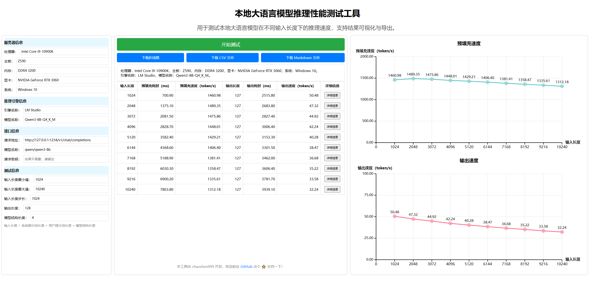

# 本地大语言模型推理性能测试工具

## 简介

本工具用于测试本地大语言模型在不同输入长度下的推理速度，支持结果可视化与导出。

## 功能特性

- **性能测试**：支持测试模型在不同输入长度下的预填充和输出速度。
- **结果可视化**：自动生成预填充和输出速度的折线图。
- **数据导出**：支持将测试结果导出为 PNG 图片、CSV 文件和 Markdown 文件。
- **详细信息查看**：支持查看完整的输入和输出内容。
- **纯前端实现**：无需依赖后端服务，即开即测。

## 使用方法

1. **打开工具页面**  
   使用浏览器打开 `llm-performance-test.html` 文件。

2. **填写测试参数**  
   - 填写服务器信息、推理引擎信息（可选）
   - 填写接口信息、测试信息（必填）

3. **开始测试**  
   点击“开始测试”按钮，工具会自动测试不同输入长度下的预填充和输出速度，并实时展示结果。

4. **查看与导出结果**  
   - 查看测试结果和折线图
   - 支持将测试结果导出为 PNG 图片、CSV 文件、Markdown 文件

## 示例

---

感谢使用本工具！如果你觉得这个项目有用，请在 GitHub 点个 ⭐ 支持一下！
